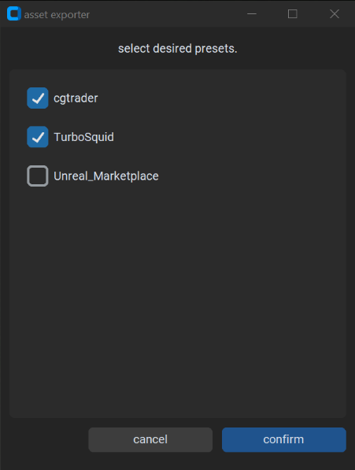
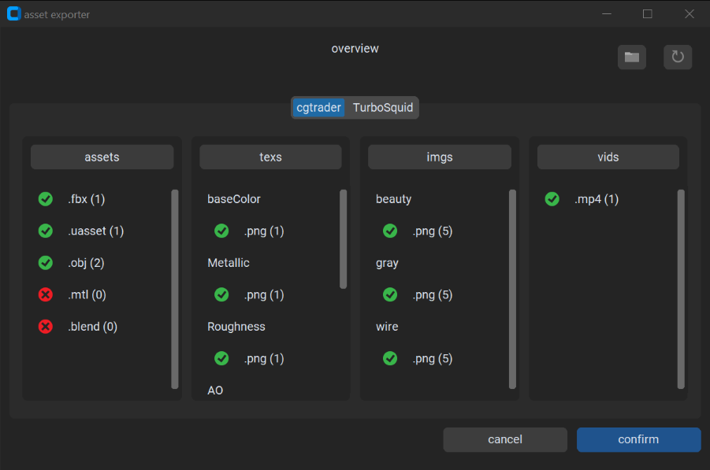
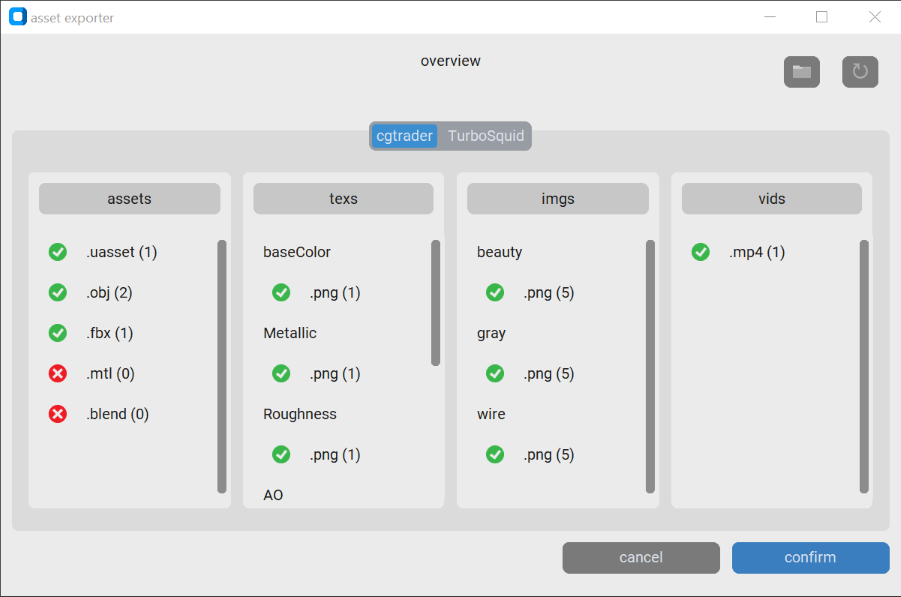

# 3d asset exporter
A python tool intended for asset validation and resource export.  

Uses  the [CustomTkinter](https://github.com/TomSchimansky/CustomTkinter) library for UI

## Features
current features:
- presets including:
  - file extention validation
  - file suffix validation
  - output directory formatting
- stats file generation including:
  - vertex count
  - total polygon count
  - tri, quad, Ngon counts
  - full list of object names
- UI:
  - scaleable
  - support for light/dark themes  

TODO:
- UI:
  - support for high contrast
  - support for keyboad navigation
  - support for screen reader
  - other accessibilty features
- validations:
  - full naming conventions
  - PBR complience
- image manipulation for watermarking, mipmapping
- dependency path redirection
- file size stats output
- optional zip output  

## Setup
requires Python 3.7 or greater

install steps:
- download or clone this repository
- install dependencies:  
  ```pip3 install -r requirements.txt```
- create a shortcut/desktop entry pointing to `assetExporter.py` with either:
  - the dir passed as a command line argument
  - a modifed working dir:
    - Windows: in the shortcut's properties set 'start in' blank
    - Linux: set the desktop entry's 'Path' key to `./`
- modify the provided exemple `presetSettings.json` and `dirLayout.json` to fit your requirements.  
all paths are relative to the above shortcut / specified path  

## Gallery
all images bellow use the provided `presetSettings.json` file for demonstration purposes:  

  
dark mode view of the preset selection window  

  
dark mode view of the overview window  

  
light mode view of the overview window  

## License
[MIT](./LICENSE)